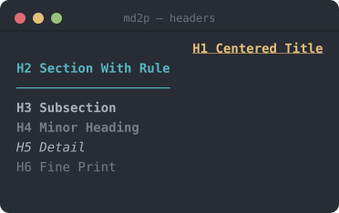
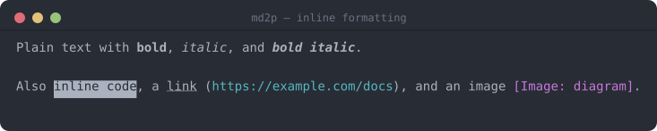
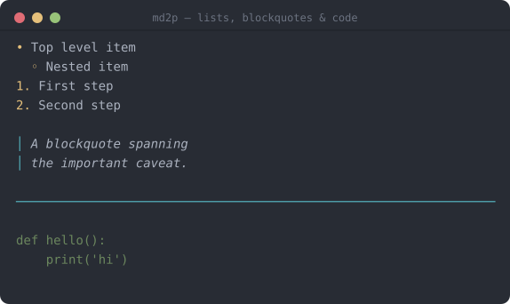
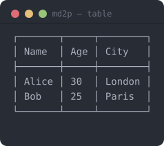
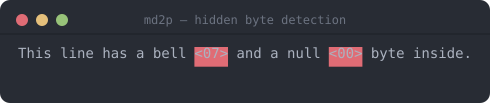

# md2p

Markdown to Print (md2p)

`md2p` is a small command-line utility for rendering Markdown files to the terminal, using ANSI (or nroff) escape sequences for styling. It is intended as a lightweight helper to preview Markdown content without leaving the terminal.


## Version

Current version: 1.0

## Features

- Renders to stdout with ANSI colour/style escapes, or nroff overstrike sequences via `--nroff`
- Simple CLI usage with a Markdown file path, or via stdin
- Supported Markdown elements:
  - ATX headers `#`–`######` (each level styled distinctly) and setext headers (`===`/`---`)
  - Horizontal rules, blockquotes, fenced code blocks (` ``` `/`~~~`)
  - Ordered and unordered lists, including nested indentation
  - Tables, rendered as bordered ASCII grids
  - Inline formatting: bold, italic, bold+italic, inline code, links, images
- Non-printable bytes and hidden Unicode variation selectors (a common vector for invisible watermarks/payloads) are never passed through silently — each is replaced with a visible hex marker (see example below)
- Input is capped at 50 MB and raw ANSI escapes in the source file are stripped before rendering, so a malicious Markdown file can't inject terminal escape sequences

## Installation

1. Ensure you have Python 3.8+ installed.
2. (Optional) Create and activate a virtual environment:

```bash
python3 -m venv .venv
source .venv/bin/activate
```

There are no external dependencies required by default. 

### From PyPI

```bash
pip install md2p
# or, without installing into an environment:
uvx md2p README.md
```

Linux (user install)

To install `md2p` for your user on Linux, use the included `install.sh` to copy the script to `~/.local/bin` (or your `XDG_BIN_HOME`):

```bash
chmod +x install.sh
./install.sh
# or specify destination explicitly
./install.sh --dest "$HOME/.local/bin"
```

Uninstall with:

```bash
./install.sh --uninstall
```

Ensure your user bin directory is in `PATH`, for example add to your shell profile:

```bash
export PATH="$HOME/.local/bin:$PATH"
```

## Usage

Run the script with a Markdown file path:

```bash
python3 md2p.py path/to/file.md
```

This prints the processed Markdown to stdout. Redirect output to a file if desired:

```bash
python3 md2p.py README.md > out.txt
```

You can also pipe Markdown in on stdin:

```bash
cat README.md | md2p
```

### Options

- `-v`, `--version` — print the version and exit.
- `-n`, `--nroff` — emit nroff overstrike sequences (`X⌫X` for bold, `_⌫X` for
  underline) instead of ANSI colour escapes. This is for viewers that interpret
  the classic nroff bold/underline convention but not ANSI SGR colours — most
  notably Midnight Commander's internal file viewer in `nroff` mode. Colours,
  dim and italic are mapped onto the two available styles (bold / underline).

### Midnight Commander integration

To preview Markdown with formatting inside `mc`'s internal viewer (F3), add the
following to `~/.config/mc/mc.ext.ini`:

```ini
[markdown]
Regex=\.(md|mkd|mdown|markdown)$
RegexIgnoreCase=true
View=%view{nroff} md2p --nroff %f
```

`%view{nroff}` tells the internal viewer to interpret the overstrike sequences
produced by `md2p --nroff`. For full ANSI colour instead, drop `%view` and pipe
through a colour-capable pager: `View=md2p %f | less -R`.

### Example: Headers

Each ATX header level (`#` through `######`) gets distinct styling — H1 is centred, bold, underlined; H2 gets an underline rule; H3–H6 step down through bold, dim, italic, and plain dim text.

**Source Markdown:**

```markdown
# H1 Centered Title
## H2 Section With Rule
### H3 Subsection
#### H4 Minor Heading
##### H5 Detail
###### H6 Fine Print
```

**Terminal output:**



### Example: Inline Formatting

Bold, italic, bold+italic, inline code, links, and images are all styled distinctly.

**Source Markdown:**

```markdown
Plain text with **bold**, *italic*, and ***bold italic***.

Also `inline code`, a [link](https://example.com/docs), and an image .
```

**Terminal output:**



### Example: Lists, Blockquotes & Code Blocks

**Source Markdown:**

````markdown
- Top level item
  - Nested item
1. First step
2. Second step

> A blockquote spanning
> the important caveat.

---

```
def hello():
    print('hi')
```
````

**Terminal output:**



### Example: Markdown Table

Tables are rendered as bordered ASCII grids with aligned columns.

**Source Markdown:**

```markdown
| Name  | Age | City   |
|-------|-----|--------|
| Alice | 30  | London |
| Bob   | 25  | Paris  |
```

**Terminal output:**



### Example: Non-printable Characters & Hidden Watermarks

Non-printable characters (anything that is not a printable Unicode character, newline, carriage return, tab, or space) are never passed through silently. Each such character is replaced inline with a red-background hex marker so it is immediately visible. Single-byte characters are shown as `<HH>`, and multi-byte UTF-8 sequences as `<H0,H1,...>`.

**Source Markdown** (paragraph contains a raw `BEL` U+0007 and a `NULL` U+0000):

```
This line has a bell \x07 and a null \x00 byte inside.
```

**Terminal output:**



The surrounding text is printed normally; only the offending bytes are highlighted, making it easy to spot encoding errors or accidental binary content in Markdown source files.

This also catches Unicode **variation selectors** (`U+FE00`–`U+FE0F` and `U+E0100`–`U+E01EF`). Python's `str.isprintable()` reports these as printable even though they render with zero visible width, and they are the block most commonly used today to smuggle hidden bytes — watermarks or payloads — onto an otherwise ordinary-looking character. `md2p` checks for them explicitly and flags each one with the same red-background hex marker, so text carrying a hidden variation-selector payload is not silently invisible in the rendered output.

## Development & Tests

Run the existing tests with `pytest`:

```bash
pytest -q
```

## Contributing

Contributions and bug reports are welcome. Open an issue or submit a pull request.

## License

This project is licensed under the MIT License — see the `LICENSE` file for details.

